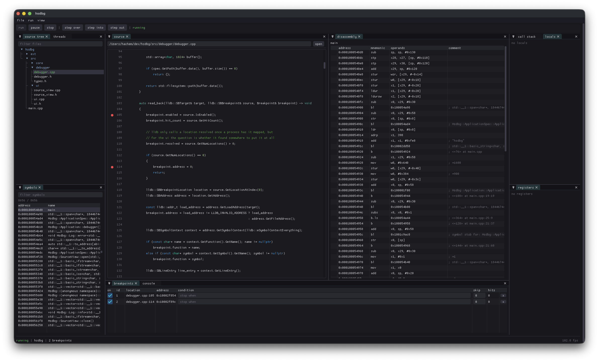

<h1 align="left">
  
  hachem's stupid debugger
</h1>

hsdbg is a cross-platform GUI debugger for C and C++. I wrote it because I didn't like the options I had. Debugging is a visual thing, at least to me. I want to see the source, the state of the program, the stack, my variables, registers, and whatever else is going on, all at once. Most of the good C/C++ debuggers are either terminal programs or tied to one platform. The only ones I've actually liked are RemedyBG and Visual Studio. Both are Windows-only. I'm not on Windows, so I made my own.

hsdbg is meant to be a debugger, not a full IDE. It should start quickly, work on everything I use, and have the stuff I actually reach for without turning into an entire development environment. Underneath, it's an LLDB frontend. LLDB does the debugging; hsdbg is the UI I wish I had on top of it.

## Features
The usual debugger stuff is there. You can launch or attach to processes, step through code, and set breakpoints by line, function, or address. Breakpoints can have conditions and ignore counts.
 There's a source view with syntax highlighting and a breakpoint gutter, alongside locals, registers, threads, and the call stack. There's also disassembly, symbols, and raw memory for when you need to go further down.

The console lets you type C or C++ directly into the debugger, which LLDB JIT-compiles and runs inside the debugged process. So if you do something like `a = 60` you actually changed `a`, and that change sticks when you continue.



## Build
hsdbg builds on macOS, Linux, and Windows. You'll need [premake5](https://premake.github.io/) and a C++23 compiler. hsdbg links against LLVM/LLDB. By default, it pulls the pinned LLVM release (22.1.0) for your platform. Alternatively, you can point it at an existing LLVM installation that ships the LLDB headers with `LLVM_PREFIX`, or have `llvm-config` available on your `PATH`.

```bash
$ git clone --recursive https://github.com/hachem-wtf/hsdbg.git
$ cd hsdbg

$ premake5 fetch-llvm
$ premake5 gmake2
$ make config=dist

$ ./bin/dist-macosx/hsdbg ./a.out
```

The binary lands in `bin/dist-<system>/hsdbg`.


## License
hsdbg is released under the [MIT License](LICENSE).
